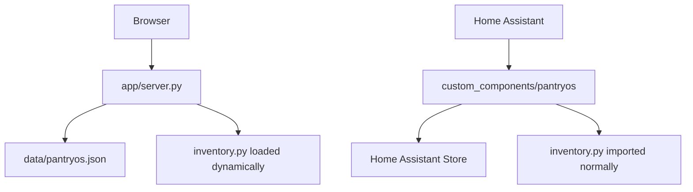

# 2. Verified baseline

## Source snapshot

The supplied repository is a compact Python 3.12 proof of concept:

```text
app/server.py                         dependency-free threaded HTTP server + JSON repository
app/static/index.html                 kitchen dashboard markup
app/static/app.js                     browser state, rendering, and API calls
app/static/styles.css                 responsive dashboard styling
custom_components/pantryos/           Home Assistant custom integration
custom_components/pantryos/inventory.py
                                      shared in-memory domain model and calculations
tests/test_inventory.py               domain tests
tests/test_app_server.py              repository and HTTP smoke tests
scripts/run_tests.py                  dependency-free test runner
Dockerfile / compose.yaml             single-container local app
```

## Verification performed on 2026-08-25

| Check | Result |
|---|---|
| `python scripts/run_tests.py` | **11 tests passed** |
| `python -m compileall -q app custom_components/pantryos scripts tests` | Passed |
| `node --check app/static/app.js` | Passed |
| `docker compose config` | Not executed; Docker is not installed in the inspection environment |
| Forced two-writer JSON repository test | **Failed data-integrity expectation:** both writes returned, only one item survived |

The exact output and reproducer are in `docs/handoff/evidence/`.

## Implemented vertical slice

| Capability | Baseline behavior | Primary source |
|---|---|---|
| Inventory item model | Name, quantity, unit, location, purchase/expiration dates, open flag, minimum stock, barcode, cost, tags, notes | `custom_components/pantryos/inventory.py:51-116` |
| Add/consume/delete/move | Manager operations and HTTP/HA actions | `inventory.py:250-287`, `app/server.py:220-240`, `__init__.py:44-70` |
| Recipes | Ingredients, prep time, instructions, tags | `inventory.py:118-172` |
| Recipe matching | Exact normalized name plus exact unit; missing ingredient calculation | `inventory.py:334-369` |
| Expiring soon | Four-day window by default | `inventory.py:371-388` |
| Minimum stock suggestions | Derived from item-level minimums | `inventory.py:390-406` |
| Shopping list | Manual rows, recipe shortages, promoted stock suggestions | `inventory.py:303-325` |
| Meal plan | String dictionary from a day label to recipe name | `inventory.py:208-234`, `298-301` |
| Leftovers | Normal inventory rows tagged `leftover` | `inventory.py:108-110`, `app/server.py:85-98` |
| Waste estimate | Cost of currently stored items that expired in the current month | `inventory.py:415-427` |
| Web dashboard | Tonight, Use Soon, Shopping, Quick Meals, inventory, recipes, add forms | `app/static/index.html`, `app/static/app.js` |
| Home Assistant | Ten sensors and nine custom actions backed by HA Store | `custom_components/pantryos/` |
| Container | Python slim image and named data volume | `Dockerfile`, `compose.yaml` |

## HTTP API in the prototype

| Method | Path | Behavior |
|---|---|---|
| GET | `/api/state` | Return the full public dashboard state |
| POST | `/api/seed?reset=true` | Seed or reset fixed demo data |
| POST | `/api/items` | Add inventory item |
| POST | `/api/items/{id}/consume` | Consume a quantity |
| POST | `/api/items/{id}/move` | Move item |
| DELETE | `/api/items/{id}` | Delete item |
| POST | `/api/recipes` | Add recipe |
| POST | `/api/recipes/{name}/shopping` | Append current missing ingredients |
| POST | `/api/shopping` | Add/merge a source-specific row |
| POST | `/api/shopping/promote-suggestions` | Append current stock suggestions |
| POST | `/api/meal-plan` | Map label/day to recipe name |

There is no update route for items or recipes, no shopping check/uncheck/delete route, no purchase completion route, no receipt route, no barcode lookup route, no API versioning, and no authentication.

## Home Assistant baseline

### Sensors

- Total items
- Expiring soon
- Shopping list count
- Suggested purchases
- Possible meals
- Food waste this month
- Kitchen items
- Refrigerator items
- Freezer items
- Pantry items

### Actions

- `pantryos.add_item`
- `pantryos.consume_item`
- `pantryos.delete_item`
- `pantryos.move_item`
- `pantryos.add_recipe`
- `pantryos.plan_meal`
- `pantryos.add_shopping_item`
- `pantryos.add_missing_to_shopping_list`
- `pantryos.promote_suggested_purchases`

The integration config flow creates an empty local entry. It does not ask for a PantryOS URL or token. `PantryStore` persists a separate state document in Home Assistant storage (`custom_components/pantryos/store.py:14-26`).

## Current architecture



The code is shared, but the state is not. The architecture therefore cannot satisfy cross-interface consistency.

## Demonstrated JSON race

`JsonInventoryRepository.mutate()` performs an unprotected read-modify-write (`app/server.py:75-79`). The included reproducer forces two threads to load the same state before either saves. Both mutations complete without an exception; the last replacement wins and one item disappears.

Expected:

```text
items: ['Milk', 'Eggs']
```

Observed baseline:

```text
errors: []
items: ['Milk']
```

This is a release-blocking data-loss defect and the primary reason persistence must be replaced before feature expansion.
