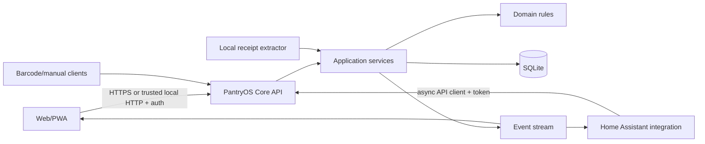

# 4. Target architecture

## Required system boundary



PantryOS Core is the only component allowed to mutate the database. Home Assistant must not mount the database volume or import server repositories.

## Recommended implementation stack

The implementation may vary only with a documented ADR that preserves the same guarantees.

### Core service

- Python 3.12 or newer.
- FastAPI for versioned HTTP contracts and generated OpenAPI.
- Pydantic v2 models for request/response validation.
- SQLAlchemy 2.x and Alembic for persistence and migrations.
- SQLite with foreign keys, a configured busy timeout, and WAL when compatible with the deployment filesystem.
- Uvicorn for the application server.
- Structured standard logging; JSON output should be available for containers.

### Web

Preserve the existing no-build frontend when it remains maintainable, or introduce a documented TypeScript build only when it improves testability and structure. A framework migration is not a completion objective by itself.

Required regardless of tooling:

- Modular client code with a typed or explicitly documented API boundary.
- Responsive PWA manifest and installable shell.
- Keyboard and screen-reader usability.
- Browser camera barcode flow with feature detection and manual fallback.
- Automated browser tests for critical flows.

### Home Assistant

- Async `aiohttp`-based client using Home Assistant's shared session.
- Config entry containing instance URL and token; unique ID derived from the PantryOS instance ID.
- `config_entry.runtime_data` (or the current supported typed equivalent) for client/coordinator state.
- Server-sent events or WebSocket push when reliable, with a bounded polling fallback.
- `DataUpdateCoordinator` or an equivalent coordinated state cache so entity properties perform no I/O.
- Actions registered at integration setup and resolved against the active config entry.

## Suggested repository shape

```text
src/pantryos/
  api/                 FastAPI routes, schemas, auth, problem responses
  application/         use cases and transaction boundaries
  domain/              entities, value objects, conversion and matching rules
  infrastructure/      SQLAlchemy models/repos, migrations, OCR, backups, events
  settings.py
  cli.py

alembic/
  versions/

app/static/             web/PWA assets, or generated distribution
custom_components/
  pantryos/
    api_client.py
    coordinator.py
    config_flow.py
    diagnostics.py
    sensor.py
    __init__.py

tests/
  unit/
  integration/
  migrations/
  home_assistant/
  browser/
  fixtures/

scripts/
  smoke_e2e.py
  backup_restore_smoke.py

docs/
  adr/
  operations/
  api/
```

Do not preserve `custom_components/pantryos/inventory.py` as the shared runtime package. Extract reusable domain logic into `src/pantryos/`. The Home Assistant integration should depend on the HTTP contract, not import the core domain or repositories.

## Runtime responsibilities

### API layer

- Authenticate and authorize.
- Validate request shape and content limits.
- Translate application exceptions into stable problem responses.
- Enforce idempotency and optimistic version checks where appropriate.
- Expose state snapshots and an event stream.
- Never contain business calculations that are needed outside one route.

### Application layer

- Own transaction boundaries.
- Orchestrate repositories and domain services.
- Append inventory events in the same transaction as lot changes.
- Publish events only after commit.
- Make receipt commits, cooking completion, shopping purchase, and legacy import atomic.

### Domain layer

- Enforce quantities, units, expiration usability, FEFO allocation, recipe scaling, demand aggregation, and price/waste calculations.
- Remain independent of FastAPI, SQLAlchemy sessions, Home Assistant, and browser code.

### Infrastructure layer

- Map domain records to SQLite.
- Apply migrations and indexes.
- Implement backup/restore and legacy import.
- Implement the event broker and OCR/provider adapters.
- Contain external integrations behind protocols/interfaces.

## Event model

Every successful mutation increments an instance state revision and publishes an event after commit. Clients can fetch a fresh summary when an event is received.

Minimum events:

- `inventory.lot_added`
- `inventory.consumed`
- `inventory.moved`
- `inventory.opened`
- `inventory.adjusted`
- `inventory.discarded`
- `inventory.waste_recorded`
- `product.changed`
- `location.changed`
- `recipe.changed`
- `meal_plan.changed`
- `shopping.changed`
- `cooking.started`
- `cooking.completed`
- `receipt.review_ready`
- `purchase.recorded`

Events contain IDs, revision, timestamp, and safe summary metadata. They must not expose tokens, receipt images, or sensitive diagnostics.

## Deployment model

### Supported minimum

- One PantryOS container.
- One persistent volume containing SQLite, uploads, and backups in separate subdirectories.
- Config through environment variables or a mounted config file.
- Default local port `8765` retained where practical.
- Non-root container user.
- Health endpoints:
  - liveness: process responds;
  - readiness: database migration complete and a transaction succeeds.

### Home Assistant connectivity

Home Assistant receives a base URL and long-lived PantryOS API token. It does not need PantryOS to call Home Assistant. Cooking and inventory events become HA state changes/events; HA automations perform lights, notifications, tablet control, and freezer alerts.

## Legacy transition

1. Detect legacy `data/pantryos.json` only when the database has not already imported it.
2. Validate the entire document before changing the database.
3. Create a timestamped immutable backup.
4. Map legacy inventory rows to products and lots; deduplicate products by normalized name/unit with a documented policy.
5. Map path strings to hierarchical locations.
6. Map recipes and ingredients, retaining unresolved ingredient text for review.
7. Map shopping rows and meal plan labels without multiplying demand.
8. Commit atomically and record an import marker/hash.
9. Leave the source file untouched or rename it only after successful commit; document the behavior.
10. Re-running startup must not import the same rows twice.
