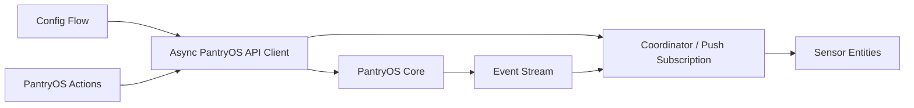

# 10. Home Assistant integration plan

## Role of the integration

The integration exposes PantryOS Core state and commands to Home Assistant. It is not a second PantryOS runtime.



## Required configuration

Config flow fields:

- PantryOS base URL
- API token
- TLS verification option only when there is a defensible local-certificate use case

Flow behavior:

1. Normalize URL.
2. Call `/api/v1/instance` with a bounded timeout.
3. Distinguish cannot-connect, invalid-auth, unsupported-version, and unknown errors.
4. Use returned instance ID as unique ID.
5. Prevent duplicate entries for the same instance.
6. Store only required connection data; never log the token.
7. Support reconfigure and reauth.

## Runtime structure

Suggested files:

```text
custom_components/pantryos/
  __init__.py
  api_client.py
  config_flow.py
  const.py
  coordinator.py
  diagnostics.py
  sensor.py
  services.yaml
  strings.json
  translations/en.json
  manifest.json
```

Use one runtime object containing client, coordinator, instance metadata, and subscription state. Entity properties read coordinator data and perform no network or database I/O.

## Updates

Preferred behavior:

- Subscribe to the authenticated PantryOS event stream.
- On event, fetch or apply a bounded dashboard snapshot and call the coordinator update path.
- Maintain a periodic recovery refresh so a missed event or stream reconnect cannot leave stale state indefinitely.
- Set the manifest IoT class to match the actual behavior (`local_push` when push is primary; otherwise responsible `local_polling`).
- Expose availability and last successful update.

## Actions

Register actions at integration setup so automations can be edited even when an entry is offline. Resolve the target PantryOS entry at call time. With a single-config-entry manifest, resolution is straightforward, but implementation should still avoid a stale captured store object.

Preserve or migrate these names:

- `add_item`
- `consume_item`
- `delete_item` only as an administrative correction; prefer `discard_item`
- `move_item`
- `add_recipe`
- `plan_meal`
- `add_shopping_item`
- `add_missing_to_shopping_list`
- `promote_suggested_purchases`

Add as needed:

- `open_item`
- `adjust_item`
- `discard_item`
- `rebuild_shopping`
- `start_cooking`
- `complete_cooking`
- `create_leftover`

Actions should use selectors, translated names/descriptions, stable schemas, and response data where useful. API/domain errors should become clear `HomeAssistantError` or current recommended exceptions without leaking tokens.

## Entities

Minimum useful sensors:

- total active products/lots, with names chosen to avoid ambiguity;
- expiring soon count;
- shopping list count;
- suggested purchase count;
- possible meal count;
- leftover servings/count;
- food waste value this month;
- inventory value by configured major location;
- pantry/refrigerator/freezer lot counts;
- PantryOS state revision or health where useful.

Keep entity attributes bounded. A sensor may include the top urgent items or meals, but it should not place the full inventory or receipt data in state attributes.

Use appropriate device classes and native numeric values. Currency metrics must be numeric and identify currency.

## Device and diagnostics

Represent the PantryOS instance as a service/device when supported. Include version, base URL host, and instance ID, but no token.

Diagnostics should include:

- integration and API versions;
- sanitized base URL;
- capabilities;
- coordinator status and last update;
- entity summary;
- redacted error category.

Diagnostics must remove authorization headers, token, session cookies, receipt text/images, product notes marked private, and raw uploaded file paths.

## Example automation outcomes

### Use-soon notification

At a configured time, notify with the most urgent lot and a recommended recipe that uses it.

### Grocery arrival

When a household member enters the grocery geofence, announce the active shopping count and optionally open the list.

### Cooking mode

When `cooking.started` arrives, Home Assistant can activate a kitchen scene, wake a tablet, and display the recipe. PantryOS should emit the event; it should not directly control lights.

### Freezer risk

A Home Assistant automation combines the freezer temperature entity with PantryOS's location value sensor to report duration and approximate at-risk value.

## Required HA tests

- user config success and all major error branches;
- duplicate instance prevention;
- setup, unload, reload, reconfigure, reauth;
- initial fetch failure and automatic retry;
- stream update and recovery poll;
- entity availability and bounded attributes;
- representative action success/failure;
- service registration lifecycle;
- diagnostics redaction;
- no use of Home Assistant Store for inventory.
